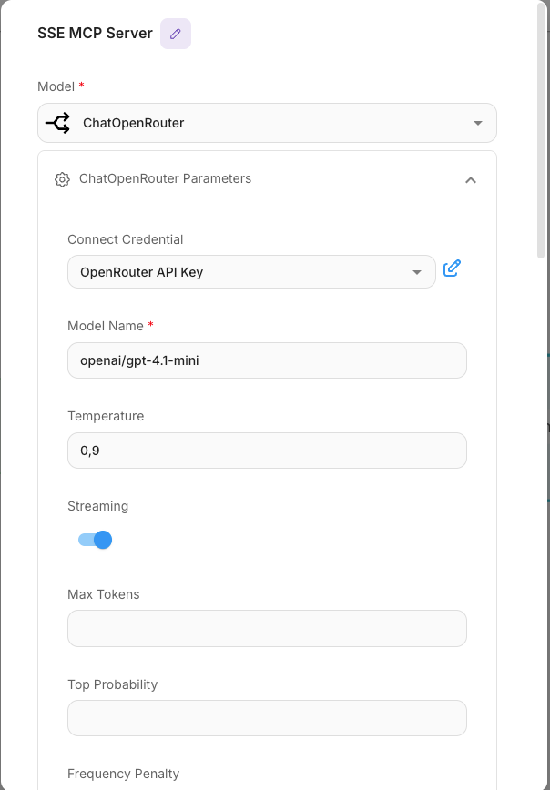
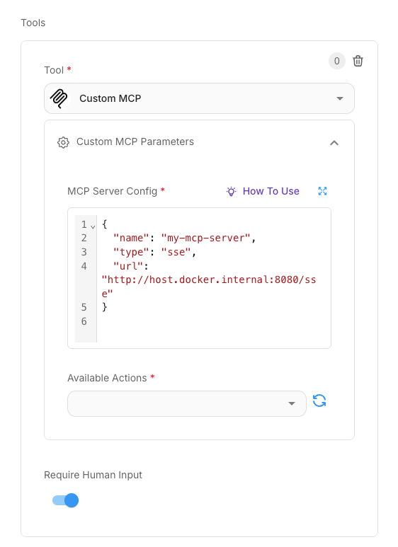

# 🔌 SSE MCP Server

A lightweight **Spring Boot Kotlin** application acting as an **MCP (Multi-Command Provider)** server over **Server-Sent Events (SSE)**, designed for seamless integration with [FlowiseAI](https://flowiseai.com/) or other LangChain-compatible agents.

> Enables dynamic tool execution such as math and date operations from your agent workflows.

---

## 🚀 Features

- 🔁 Exposes SSE-compatible endpoints
- 🔧 Supports configurable tool providers (e.g., Math, Date/Time)
- 🧠 Works out-of-the-box with Flowise agents
- 🐳 Docker Compose support
- 📃 Auto-generated manifest endpoint for tool discovery

---

## 📦 Getting Started

### 1. Clone & Configure

```bash
git clone https://github.com/your-org/sse-mcp-server.git
cd sse-mcp-server
cp .env.example .env
```

### 2. Run with Docker Compose

```bash
docker compose up -d
```

- Access the UI: [http://localhost:3000](http://localhost:3000)
- Stop containers: `docker compose stop`

---

## 🧠 Flowise Integration

### Step 1: Add a New Agent

- Go to the Flowise UI
- Add a new agent (see screenshot below)



### Step 2: Configure MCP Endpoint

Use the following JSON config inside the agent's settings:

```json
{
  "name": "my-mcp-server",
  "type": "sse",
  "url": "http://host.docker.internal:8080/sse"
}
```



> `host.docker.internal` allows the container to reach your local machine when Flowise runs in Docker.

---

## 🛠️ Available Tools

Each tool implements the `ToolProvider` interface and auto-registers via `ToolsConfiguration`.

### ✅ Built-in Tools:

| Tool        | Description                         | Endpoint     |
|-------------|-------------------------------------|--------------|
| `math`      | Perform arithmetic operations       | `/mcp/message?tool=math` |
| `datetime`  | Get current timestamp and more      | `/mcp/message?tool=datetime` |

> All tools are exposed via `/manifest.json` for automatic discovery by the agent.

---

## 🧪 Testing

```bash
./gradlew test
```

Includes basic Spring Boot test coverage using JUnit 5.

---

## ⚙️ Configuration

Edit `src/main/resources/application.yaml` to customize port, endpoints, or server name:

```yaml
spring:
  ai:
    mcp:
      server:
        enabled: true
        name: sse-mcp-server
        version: 0.1.0
        sse-endpoint: /sse
        sse-message-endpoint: /mcp/message
```

---

## 🐳 Docker Overview

- Requires `.env` file for local variables
- `docker-compose.yml` spins up all services
- `host.docker.internal` allows bridging from Docker Flowise to local server

---

## 🤝 Contributing

1. Fork the repo
2. Create your feature branch: `git checkout -b feat/my-feature`
3. Commit your changes: `git commit -am 'feat: add my feature'`
4. Push to the branch: `git push origin feat/my-feature`
5. Open a pull request 🚀

---

## 📜 License

MIT – © Yonatan Karp-Rudin, 2025
